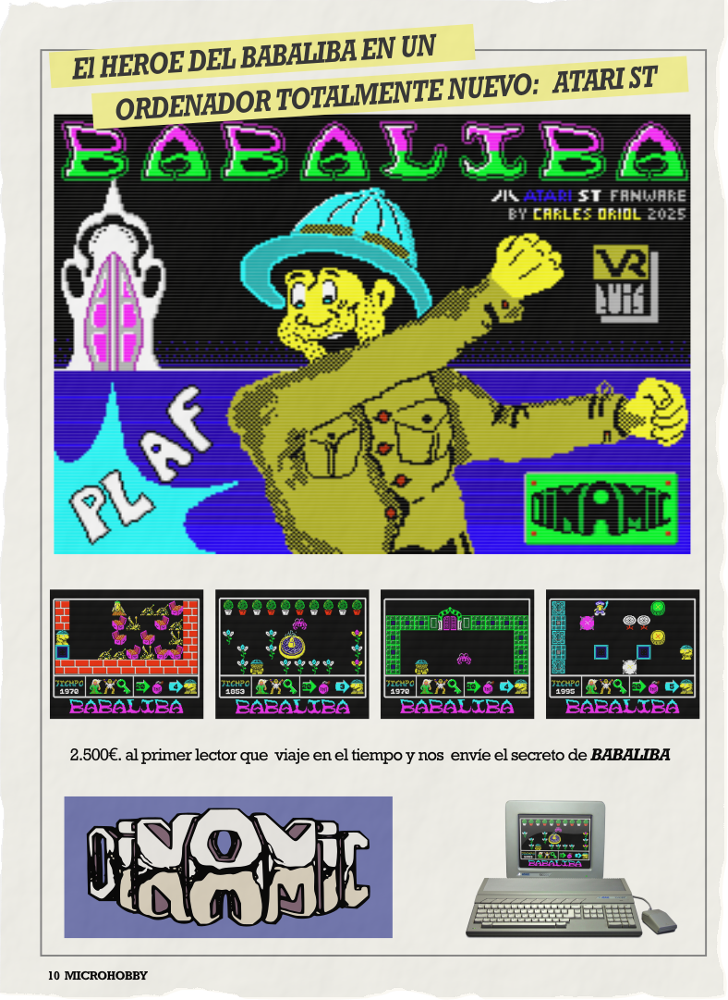

# Babaliba for Atari ST

Babaliba for Atari ST is a conversion of the classic Dinamic game. 

This fan project is non-profit and was created just for fun.

 
 

Get it at https://github.com/carlesoriol/babaliba 
Downloads: https://github.com/carlesoriol/babaliba/tree/main/release

6/1/2026 - Version 1.0

by Carles Oriol - Barcelona 2026
carles@enging.com

## About Babaliba

I’m an '80s kid, and Babaliba was one of the first ZX Spectrum games I ever owned.

It was not the best game ever—it had nasty sprite movement (compared to titles by Ultimate), and horrible music—but I loved it. It will always stay in my memories alongside Ant Attack, Manic Miner, Tornado Low Level, and Atic Atac.

I remember playing it on a black-and-white TV with my 48k ZX Spectrum and being fascinated when I finally got a color TV; seeing the amazing colors of the gardens and flowers was incredible.

I wanted to convert this game for my beloved Atari ST, and here it is. I initially started working in Assembly, but it was too much work, so I switched to C.

I set some restrictions for myself during development:

* Keep the original game map and design as much as possible. (fixing some bugs in the original map)

* Keep the original game mechanics.

* Keep the sound similar to the original.
  * Note: Due to my own limitations and lack of experience creating sounds for the Atari ST, I struggled with Arkos Tracker. Instead, I hardcoded the simple sounds.

* Use the original 16 colors of the Spectrum, but take advantage of the Atari ST’s capabilities to display more colors on screen simultaneously.

* Maintain the look and feel of the original graphics.

* Preserve the original spirit of the game.

* Added features: I took the liberty of adding a save/load function, a pause button, and integrated POKEs.
  * Since we are now over 50 years old—and while searching for POKEs used to be part of the fun—we can now enjoy having them built right into the game!

The original game relies heavily on "attributes" to create different colors using the same graphics. I have maintained this concept in the Atari ST version by dynamically creating modified versions of the graphics and using a color substitution table.

I hope you enjoy my conversion. It was made with lots of love, lots of flowers , and INCREDIBLY BIG NOSES. 

## Play

Load with your Atari ST or your favorite emulator. BABALIBA.TOS file located in the build folder.

* Key: **Q** - Up
* Key: **A** - Down
* Key: **O** - Left
* Key: **P** - Right
* Key: **SPACE** - Drop bomb

But, if possible, **play with joystick** in port 0.
  
### Very special keys :-D

* Key: **SHIFT + F1** - Save game to slot 1
* Key: **SHIFT + F2** - Save game to slot 2
* Key: **SHIFT + F3** - Save game to slot 3
* Key: **SHIFT + F4** - Save game to slot 4
* Key: **F1** - Restore game from slot 1
* Key: **F2** - Restore game from slot 2
* Key: **F3** - Restore game from slot 3
* Key: **F4** - Restore game from slot 4
* Key: **F9** - Pokes screen (wooooooohooo!!)
* Key: **F10** - Pause

## Compile

I created the game using Atari ST toolkit docker https://github.com/sidecartridge/atarist-toolkit-docker.

Graphics have been created using libresprite pixel a pixel pausing the original game in Retro Virtual Machine emulator.

## Thanks

* Special thanks to Victor Ruiz (VR) and the Dinamic team for creating the original Babaliba.

* Thanks to Juan Luis Arteaga for sharing the Babaliba map.

* Gratitude to the Hatari emulator team for developing such amazing tools; they made testing and debugging on my old Atari a breeze.

* Thanks to my niece for not killing me after having to endure the splash screen music and my terrible sound effects a thousand times during development.

* And thanks to my Nurieta, for everything else in my life.

## Contributing 

Just let me know if you want to suggest any changes or if you have any ideas!

## Greetings

Greetings to the team at ESP Soft for their amazing work porting the game to the Amstrad.

Greetings to the people at Compiler Soft for the PC/Mac remake. I love your version of the improved music!

## License

This source code and tools are licensed under a Creative Commons Attribution-NonCommercial (CC BY-NC)

  

